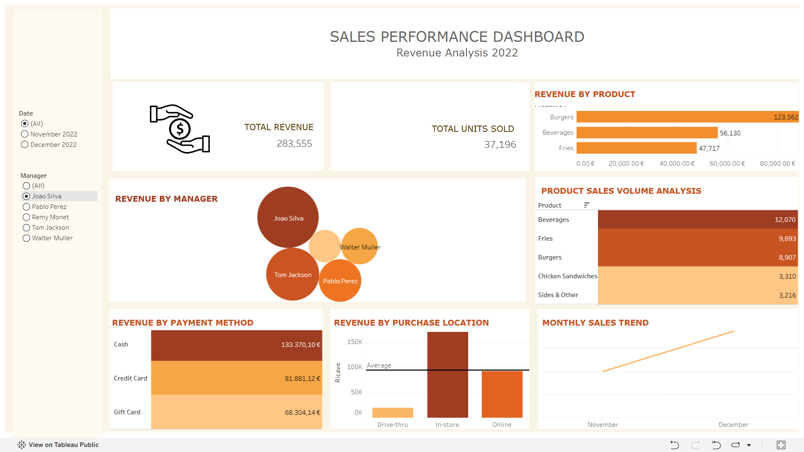

🇬🇧 [English](README.md) | 🇮🇹 Italiano

# Analisi delle vendite — Fast Food

### Dai dati transazionali agli insight di business attraverso analisi quantitativa e visualizzazione interattiva

Questo progetto analizza le performance di vendita di una compagnia fast food fittizia, combinando **Microsoft Excel** per la preparazione e l'analisi quantitativa dei dati con **Tableau** per la visualizzazione interattiva.

Il progetto non si limita alla costruzione di una dashboard, ma segue un processo analitico strutturato: dai dati transazionali grezzi alla costruzione di indicatori misurabili, fino al confronto delle performance e alla loro rappresentazione attraverso una dashboard interattiva.

La mia formazione in **Matematica** ha influenzato l'approccio utilizzato nell'analisi, in particolare nell'impiego della statistica descrittiva, nel confronto quantitativo e nell'interpretazione strutturata dei risultati numerici.

---

## Obiettivi dell'analisi

L'analisi è stata costruita a partire da alcune domande di interesse aziendale:

* Qual è il ricavo complessivo nel periodo analizzato?
* Qual è la quantità totale di prodotti venduti?
* Quali prodotti contribuiscono maggiormente ai ricavi e ai volumi di vendita?
* Come varia il ricavo tra i diversi manager?
* Quali metodi di pagamento generano i ricavi maggiori?
* Come si distribuiscono i ricavi tra i diversi canali di acquisto?
* Come cambia l'andamento delle vendite tra novembre e dicembre 2022?
* Come cambiano questi indicatori analizzando singolarmente ciascun manager?

L'obiettivo non è stato soltanto calcolare queste metriche, ma costruire un ambiente di analisi che permettesse di esplorarle dinamicamente.

---

## Approccio quantitativo

La componente matematica del progetto emerge nella trasformazione delle singole transazioni in indicatori quantitativi interpretabili.

L'analisi ha incluso:

* calcolo e confronto di misure aggregate;
* analisi statistica descrittiva delle variabili numeriche;
* analisi della distribuzione di ricavi e quantità vendute;
* confronto delle performance tra diverse categorie;
* confronto temporale dei risultati;
* analisi delle performance a livello di manager;
* interpretazione di valori centrali e metriche aggregate.

Questo processo ha permesso di trasformare un insieme di singole transazioni in una rappresentazione strutturata delle performance aziendali.

---

## Preparazione dei dati e analisi in Excel

**Microsoft Excel** è stato utilizzato come primo ambiente di analisi.

Il processo ha incluso:

**Preparazione dei dati**

* analisi iniziale del dataset;
* pulizia e strutturazione dei dati;
* controllo delle variabili rilevanti;
* creazione e gestione delle metriche necessarie all'analisi.

**Analisi esplorativa e quantitativa**

* Tabelle Pivot;
* statistiche descrittive;
* aggregazione dei ricavi;
* analisi delle quantità vendute;
* confronto tra prodotti;
* confronto tra manager;
* analisi dei metodi di pagamento;
* analisi del luogo/canale di acquisto;
* confronto dell'andamento mensile.

Il file Excel presente nel repository documenta il processo analitico alla base della dashboard finale.

---

## Outlier Analysis

As part of the exploratory analysis in Excel, I used a **box plot to identify potential outliers** in the numerical data.

I would not remove these observations automatically. In a real business environment, I would first investigate their origin by checking the underlying transaction and, when necessary, discussing the case with the **manager responsible for the related sales activity**.

The goal would be to understand whether the unusual value represents:

* a valid but exceptional transaction;
* a specific promotion or business event;
* a data-entry or recording error;
* or another operational factor.

Only after understanding the cause would I decide how to handle the observation in the analysis. Valid extreme values would generally be retained, while confirmed data-quality issues would be corrected or excluded with the decision properly documented.

---

## Dashboard interattiva in Tableau

I risultati dell'analisi sono stati successivamente trasformati in una **dashboard interattiva sviluppata in Tableau**, progettata per rendere immediatamente leggibili i principali indicatori mantenendo la possibilità di approfondire i dati.

La dashboard comprende:

* **Ricavi totali**
* **Quantità totale venduta**
* **Ricavi per prodotto**
* **Volume di vendita per prodotto**
* **Ricavi per manager**
* **Ricavi per metodo di pagamento**
* **Ricavi per luogo di acquisto**
* **Andamento mensile delle vendite**

I filtri consentono di segmentare dinamicamente l'analisi per **manager** e **periodo temporale**, aggiornando automaticamente KPI e visualizzazioni.

### Dashboard interattiva

[Esplora la dashboard su Tableau Public](https://public.tableau.com/app/profile/federica.secci5789/viz/DashboardFastFood_17870511316250/Dashboard1)

---

## Risultati principali

Considerando l'intero dataset:

**Ricavi totali:** €812.135
**Unità vendute:** 118.539

La dashboard consente inoltre di analizzare come le performance cambiano in funzione di prodotto, manager, metodo di pagamento, canale di acquisto e periodo temporale.

L'obiettivo dell'analisi non è quindi soltanto riportare un risultato complessivo, ma permettere una **lettura comparativa e multidimensionale delle performance di vendita**.

---

## Strumenti e competenze

**Microsoft Excel**

* Data Cleaning
* Tabelle Pivot
* Statistica descrittiva
* Aggregazione dei dati
* Exploratory Data Analysis
* Analisi KPI

**Tableau**

* Dashboard interattive
* Filtri
* Metriche calcolate
* Data Visualization
* Business Intelligence

**Competenze quantitative**

* Analisi statistica descrittiva
* Ragionamento quantitativo
* Analisi comparativa
* Interpretazione dei dati
* Problem solving analitico

---

## Contenuto del repository

| File                            | Contenuto                                                              |
| ------------------------------- | ---------------------------------------------------------------------- |
| `fast_food_sales_analysis.xlsx` | Workbook Excel contenente preparazione dei dati e analisi quantitativa |
| `fast_food_sales_dashboard.twb` | Workbook Tableau contenente la dashboard interattiva                   |
| `dashboard_preview.png`         | Anteprima della dashboard finale                                       |

---

## Fonte del dataset

Il dataset utilizzato nel progetto proviene dal tutorial didattico **“Master Data Analysis on Excel in Just 10 Minutes” di Kenji Explains**.

Il dataset originale è stato utilizzato come risorsa didattica e successivamente analizzato e visualizzato a scopo formativo e di portfolio.

Il processo analitico, le analisi aggiuntive e la dashboard Tableau presenti in questo repository sono stati sviluppati nell'ambito del mio portfolio personale di Data Analytics.

**Tutorial originale:**
[Master Data Analysis on Excel in Just 10 Minutes — Kenji Explains](https://www.youtube.com/watch?v=_g5roKHj95o)

---

## Il progetto

Questo progetto rappresenta l'applicazione della mia **formazione matematica alla Data Analytics**, combinando ragionamento quantitativo con strumenti utilizzati per l'analisi aziendale e la visualizzazione dei dati.

Fa parte di un portfolio in evoluzione orientato alla trasformazione delle competenze teoriche e analitiche in progetti pratici basati sui dati.
